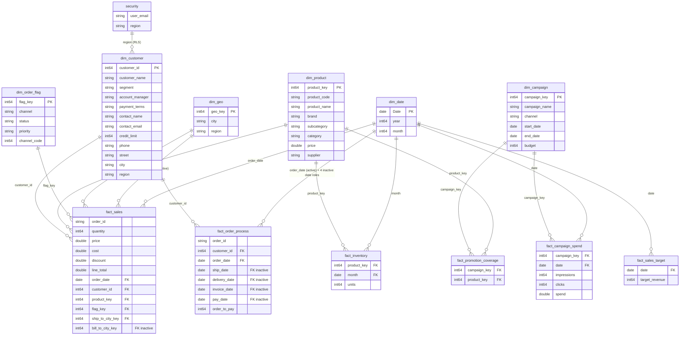

## Overview
A Power BI semantic model built around a company's sales, marketing campaigns, inventory, and order fulfillment data. Rather than a single-fact star schema, this is a **fact constellation (galaxy schema)** — six fact tables at different grains share a set of conformed dimensions, with row-level security applied by region.
 
## Business Objective
The model supports analysis across several connected areas:
- Sales performance by customer, product, region, and order channel
- Order fulfillment efficiency — time from order to payment
- Marketing campaign coverage and spend efficiency
- Inventory levels by product over time
- Actual revenue vs. target revenue
- Region-restricted access so each user only sees their own territory's data
## Data Sources
Built from a set of normalized source tables/files, including customer, contact, and address data; order headers and line items; shipment, invoice, and payment records; product and subcategory lookups; campaign logs and campaign-to-SKU mappings; monthly inventory snapshots; sales targets; and a security/region mapping table.
 
## Data Modeling Approach
 
### Fact Tables
 
| Table | Grain | Notes |
|---|---|---|
| `fact_sales` | One row per order line item | price, cost, discount, line_total, quantity |
| `fact_order_process` | One row per order | Tracks full order→ship→invoice→pay cycle; includes calculated `order_to_pay` (days) |
| `fact_inventory` | One row per product per month | Unpivoted from a wide monthly-column source layout |
| `fact_promotion_coverage` | One row per campaign–product pairing | Factless fact / bridge table — no numeric measures, just existence |
| `fact_campaign_spend` | One row per campaign per day | impressions, clicks, spend |
| `fact_sales_target` | One row per date | target_revenue |
 
### Dimension Tables
 
| Table | Key | Describes |
|---|---|---|
| `dim_customer` | customer_id | Customer profile — name, segment, account manager, payment terms, credit limit, contact info, address, region |
| `dim_product` | product_key (surrogate) | Product code, name, brand, category/subcategory, price, supplier |
| `dim_geo` | geo_key (surrogate) | City + region lookup |
| `dim_campaign` | campaign_key (surrogate) | Campaign name, channel, budget, start/end date |
| `dim_order_flag` | flag_key (surrogate) | Order channel, channel code, status, priority |
| `dim_date` | Date | Standard calendar table generated via `CALENDARAUTO()`, with year/month calculated columns |
 
### Support / Security Table
 
| Table | Purpose |
|---|---|
| `security` | Maps `user_email` → `region`. Drives a **'Regional Access'** RLS role via the relationship `dim_customer.region → security.region`, so each user only sees customers (and downstream sales/orders) in their assigned region. |
 
## Role-Playing Dimensions
 
Two dimensions play multiple roles, handled with Power BI's active/inactive relationship pattern:
 
- **`dim_geo`** in `fact_sales`: `ship_to_city_key` (active) and `bill_to_city_key` (inactive)
- **`dim_date`** in `fact_order_process`: `order_date` (active); `ship_date`, `delivery_date`, `invoice_date`, `pay_date` (inactive — activated per-measure with `USERELATIONSHIP()`)
 
## Entity Relationship Diagram
 

 
> `.pbix`/`.pbip` files are binary/structured project files that don't render diffs on GitHub — this diagram and the tables above are the authoritative reference for the model structure. Open the project in Power BI Desktop to explore interactively.
 
## Data Cleaning & Transformation Highlights
 
- **Surrogate keys generated** for `dim_product`, `dim_geo`, `dim_campaign`, and `dim_order_flag` via indexed columns, since source systems didn't provide clean integer keys for all of these.
- **Placeholder/test records removed** — a dummy customer ID, a placeholder product code, and two test supplier records were filtered out of the source data before modeling.
- **Unpivoted inventory data** — monthly stock levels arrived as separate columns per month; transformed into a proper long-format fact table (`fact_inventory`) with one row per product per month.
- **Split multi-value column into a bridge table** — campaign-to-product mappings arrived as a comma-separated SKU list per campaign; split into individual rows to build the `fact_promotion_coverage` factless fact table.
- **Normalized joins across multiple source tables** — `dim_customer` and `fact_order_process` each pull from several related source tables (customer master + contacts + user details + address + cities; orders + shipments + invoices + payments) joined and flattened into single, clean tables.
- **Text standardization** — product category values were capitalized consistently.
## Key DAX Measures
 
| Measure | Definition | Purpose |
|---|---|---|
| `total_sales` | `SUM(fact_sales[line_total])` | Total revenue |
| `total_orders` | `DISTINCTCOUNT(fact_sales[order_id])` | Order count |
| `total_active_customers` | `DISTINCTCOUNT(fact_sales[customer_id])` | Customers who have placed an order |
| `base_total_customers` | `COUNT(dim_customer[customer_id])` | All customers in the master list |
| `avg_order_to_pay` | `AVERAGE(fact_order_process[order_to_pay])` | Average days from order to payment (cash cycle efficiency) |
 
## Row-Level Security
The `security` table maps each user's email to a region. A `'Regional Access'` role uses this table together with the `dim_customer.region → security.region` relationship so that each signed-in user only sees customers — and all downstream sales, orders, and related facts — for their assigned region.
 

## Tech Stack
- Power BI Desktop
- Power Query (M)
- DAX
## How to Explore
1. Clone this repo
2. Open `data_modelling.pbip` in Power BI Desktop (it will load both the model and report together)

 
## Repository Structure
```
powerbi-data-model-project/
├── README.md
│
├── docs/
│   ├── reports/
│   ├── data_models/
│   └── screenshots/
│
├── data_modelling.pbip
│
├── data_modelling.SemanticModel/
│   └── definition/
│       ├── model.tmdl
│       ├── relationships.tmdl
│       └── tables/
│           ├── dim_customer.tmdl
│           ├── dim_product.tmdl
│           ├── fact_sales.tmdl
│           └── ...
│
└── data_modelling.Report/
    └── definition/
        └── ...                # Report pages, visuals, and metadata (JSON)
```
